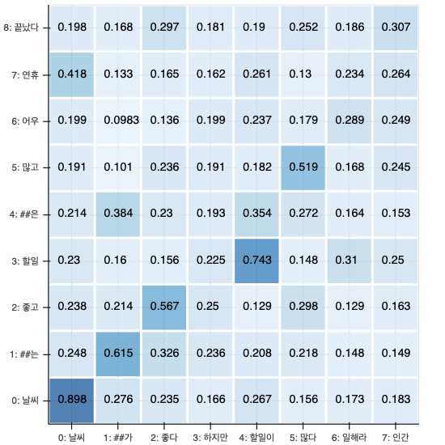
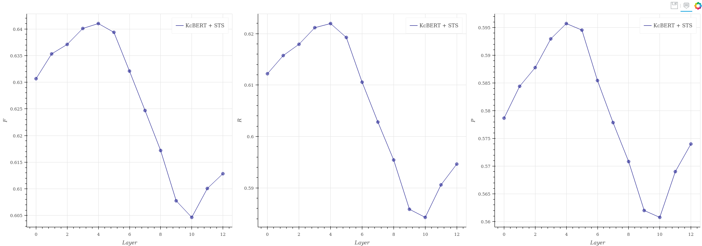

# Ko-BERTScore

BERTScore using pretrained Korean BERT. This package provides re-implemented version of BERTScore.

## Install

```
git clone https://github.com/lovit/KoBERTScore
cd ko-BERTScore
python setup.py install
```

## Usage

### Evaluate sentence pairs

Using BERTScore class instance

```python
from KoBERTScore import BERTScore

model_name = "beomi/kcbert-base"
bertscore = BERTScore(model_name, best_layer=4)

references = [
    '날씨는 좋고 할일은 많고 어우 연휴 끝났다',
    '이 영화 정말 재밌었어요',
    '영화 이야기 하는 문장인데요',
    '이 문장은 점수가 낮아야만 합니다'
]
candidates = [
    '날씨가 좋다 하지만 할일이 많다 일해라 인간',
    '영화 잘 고른거 같아',
    '브라질 열대우림이 장기간 화재로 면적이 줄어들고 있습니다',
    '테넷봤나요? 역의역의역은역인가요?'
]

bertscore(references, candidates, batch_size=128)
# [0.5643115, 0.4720116, 0.2556618, 0.2268927]
```

Using manually loaded BERT model

```python
from transformers import BertModel, BertTokenizer

model_name = "bert-base-uncased"
tokenizer = BertTokenizer.from_pretrained(model_name)
encoder = BertModel.from_pretrained(model_name)
pretrained_idf_embedding # torch.nn.Embedding

references = ['hello world', 'my name is lovit', 'oh hi', 'where I am', 'where we are going']
candidates = ['Hellow words', 'I am lovit', 'oh hello', 'where am I', 'where we go']
bert_score(bert_tokenizer, bert_model, references, candidates)
bert_score(bert_tokenizer, bert_model, references, candidates, idf=pretrained_idf_embedding)
```

### Draw pairwise cosine similarity of bert embedding

Using BERTScore class instance

```python
from KoBERTScore import BERTScore
from bokeh.plotting import show

reference = '날씨는 좋고 할일은 많고 어우 연휴 끝났다'
candidate = '날씨가 좋다 하지만 할일이 많다 일해라 인간'
bertscore = BERTScore()  # default model is 'beomi/kcbert-base'
p = bertscore.plot_bertscore_detail(reference, candidate)
show(p)
```

Loading BERT manually

```python
from transformers import BertModel, BertTokenizer
from bokeh.plotting import show, output_notebook
from KoBERTScore import plot_bertscore_detail

model_name = 'beomi/kcbert-base'
tokenizer = BertTokenizer.from_pretrained(model_name)
encoder = BertModel.from_pretrained(model_name)

reference = '날씨는 좋고 할일은 많고 어우 연휴 끝났다'
candidate = '날씨가 좋다 하지만 할일이 많다 일해라 인간'
p = plot_bertscore_detail(reference, candidate, tokenizer, encoder)

# output_notebook()  # If env is IPython notebook
show(p)
```



### Finding best layer
```
kobertscore best_layer \
  --corpus korsts \
  --model_name_or_path beomi/kcbert-base \
  --draw_plot \
  --output_dir .
```

### Finding rescale base
```
kobertscore rescale_base \
  --model_name_or_path beomi/kcbert-base \
  --references path/to/references.txt \
  --output_path MODEL_NAME_base
```

### Compute average L2 norm of every BERT layer output
```
kobertscore l2norm \
  --model_name_or_path beomi/kcbert-base \
  --references path/to/references \
  --output_path kcbert-l2norm \
  --draw_plot
```

## Performance and best-layer index of Korean BERT models

Tested correlation between BERTScore and [KorSTS](https://github.com/ko-nlp/Korpora#korsts) score

| model | layer index | correlation (F)|
| --- | --- | --- |
| 'beomi/kcbert-base' | 4 | 0.622 |
| 'monologg/distilkobert' | 12 | 0.334 |
| 'monologg/kobert' | 2 | 0.190 |
| 'monologg/koelectra-base-v2-discriminator' | 12 | 0.098 |



## Reference
- Zhang, T., Kishore, V., Wu, F., Weinberger, K. Q., & Artzi, Y. (2019). [Bertscore: Evaluating text generation with bert.](https://arxiv.org/abs/1904.09675) arXiv preprint arXiv:1904.09675.
